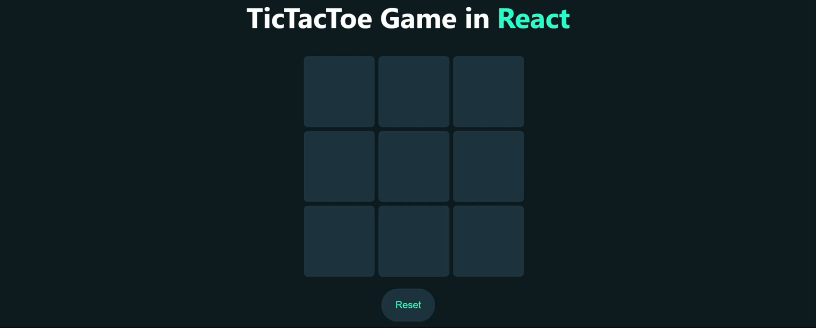

# TicTacToe Game in React

This project is a simple TicTacToe game implemented using React. It allows two players to enter their names and play against each other on a virtual TicTacToe board.

## Features

- **Player Name Entry**: Players can enter their names before starting the game.
- **Gameplay**: Players take turns clicking on empty cells to place their respective symbols (X or O).
- **Win Detection**: The game automatically detects when a player wins by achieving three symbols in a row (horizontal, vertical, or diagonal).
- **Reset Game**: Players can reset the game at any time to start over.

## Usage

1. Enter Player Names: On the initial screen, enter the names of Player X and Player O.
2. Start Game: Click on "Start Game" to begin playing.
3. Gameplay: Players take turns clicking on the board cells to place their respective symbols (X or O).
4. Win Condition: The game will automatically detect and announce when a player wins.
5. Reset: Click on "Reset" to restart the game.

### Enter Player Names

Before starting the game, players are prompted to enter their names. This step personalizes the game experience by displaying player names during gameplay and in victory announcements. If a player does not enter a name, default names ("Player X" or "Player O") are assigned.

- **Player X**: Represents the player who starts the game with the X symbol.
- **Player O**: Represents the second player who uses the O symbol.

Players can input their names directly into the provided input fields. If they choose to skip this step, they can proceed with default names. This feature allows for customization and adds a personal touch to each game session.

Once both players have entered their names and clicked on "Start Game" or "Skip" (to proceed with default names), the game begins with the initial player making the first move on the TicTacToe board.

## Technologies Used

- React
- JavaScript (ES6)
- CSS (for styling)
